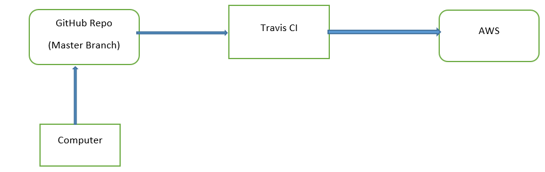
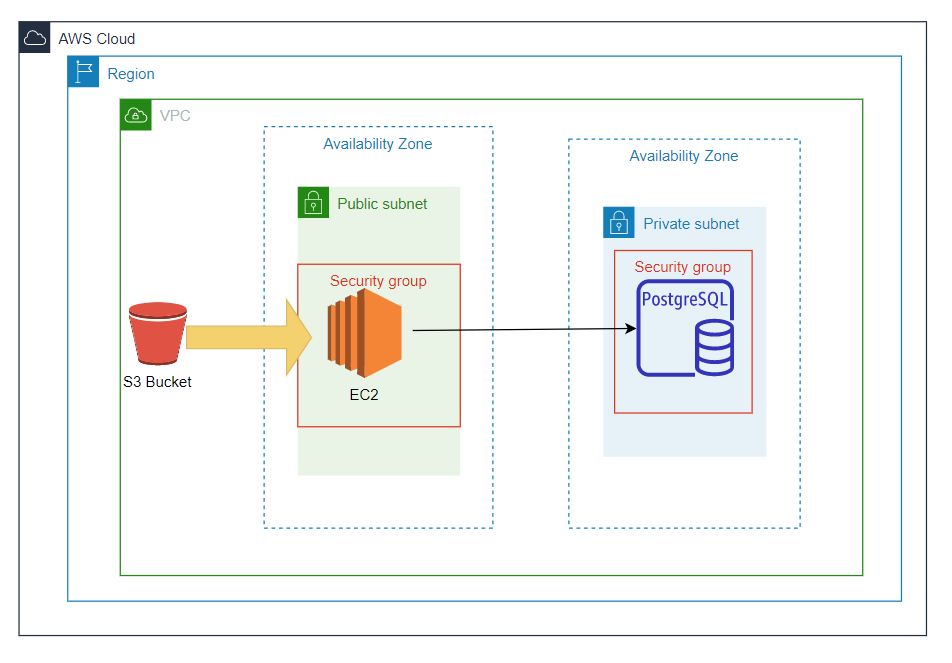

# **Digitaler Anamnese-Bogen**
___
Keywords: *SaaS, AWS, CI/CD*
___
## Einleitung
#### Motivation/Anforderungen:
- Echtes Kunde Projekt
- Digitale Anamnese-Bogen zur  Erhebung von Patientendaten in einer Arztspraxis.
- Es soll möglich sein schnell die Daten aus dem Bogen für den Behandelnden Arzt sichtbar zu machen.
- Es soll/kann in einer Cloudumgebung bereitgestellt werden
- Es soll Kontakten zwischen Angestellten und zwischen Patienten in der Praxis reduziert werden.
- Prototypische Entwicklung einer Webanwendung


- Admin Dashboard
  - Patienten Daten verwalten (Bearbeiten, löschen, etc ...)
  - Später Statistiken erheben für Studien (Post MVP)


- User Dashboard:
  - Profil anlegen und bearbeiten
  - Bogen ausfüllen
  - Angegebene Anamnesedaten später bearbeiten
  - Post MVP:
    - QR-Code der Anwendung erstellen
- Ausdruckbare Bogen erstellen (Post MVP)
- Speicherung von Statistiken in der Cloud (Post MVP)


#### Ziel
Ein Prototyp der Anwendung soll entwickeln und in AWS-Cloud bereitgestellt werden. Mithilfe von SaaS Lösungen soll die Andwendung automatisch gebaut, kontinuierlich integriert und bereitgestellt werden.

#### Aufgabenstellung
Damit der Entwicklungs- und der Bereitstellungsprozess automatisch Ablauft, werden SaaS (Software as a Service) benötigt, die die Automatisierung ermöglicht macht. Dazu werden Passende Werkzeuge bzw. Technologien zusammengestellt. Desweiteren werden die Benutzeroberfläche getrennt vom Server (Backend)
entwickeln. Um die Kommunication mit dem AWS Cloud zu ermöglichen, werden Rollen und Zugriffsrechten erstellt und so vergeben, dass Der CI-Server auf dem *Simple storage*, auch S3 genannt, um die Anwendung (Backend) dort zu befordern. Von dort übernimmt den CodeDeploy die Bereitstellung auf das Ec2. Instanzen.
Die Bereitstellung der Benützeroberfläche (Frontend) verläult denselben Weg wie das Backend, allerdings nur bis zu S3.  

___
## Verwendete Technologien/Tools

- CI/CD
  + CI: SaaS Travis
  + Maven als Build tool
  + GitHub als VCS
  + AWS CodeDeploy


- AWS Dienste:
  - S3:         zum zwischen Abladen des compilierten Codes
  - CodeDeploy: automatische Bereitstellung der Anwendung in EC2
  - EC2: Ziel des Bereitstellungsprozesses
  - RDS:        Postgres Datenbank zur Persistierung der Daten.
  - VPC (mit Subnetzen): Bereitstellung in einer privaten Cloudumgebung
  - IAM, Security group: Erteillung/Einschränkung von zusätzlichen Zugriffsrechten
 
___
## Technische Details

#### Frontend App
Eine Webanwendung mit:
- Angular CLI: Tool zum Aufsetzen der Anwendung
- Node Js als Build tool
  - Packagemanagement und Installation
  - Überprüfung des korrekten Einrichtens der RUN-Umgegebung
  - Bauen der Webanwendung
-  HTML, Typescript

#### Backend App
Hier werden die verschiedenen Endpoints für das Frontend bereitgestellt, die Verbindung zur AWS Datenbank realisiert.
  - Spring boot Anwendung (inkl. Tomcat server)
  - JPA Dependencies zur Persistierung in der Datenbank
  - AWS RDS Postgres als Datenbank
  - H2 Database fur Integrationstests
  - Jacoco plugin für die Generierung von Testcoverage report
  - Surefire-plugin für die Einteilung in Unit- und Integrationstests
  - RestAssured/Mockito/JUnit 5 für Tests
  - Maven für die automatische Bereitstellung der Dependencies und Bauen des Projekts

#### Bereitstellungsprozess

Hier wird der Bereitstellungsprozess mit einem "git"-Befehl (git push) auf eigenem Rechner gestartet. Automatisch wird zum Bauen der Anwendung das Maven (bzw. npm von Node) Tool angesetzt. Da der Build-Prozess mit den unterschiedlichen Testphasen in Travis-CI eingebettet ist, wird nach erfolgreichem Build die Anwendung in den AWS-Cloudumgebung bereitgestellt.

#### Travis-CI in Backend
Die drei wichtigsten Phasen sind: before_script, script und deploy.
- *Before_script - Block:*
Übersetzung von DOS-Skripte in Ausführbaren Unix Shell-Dateien in EC2-Instanzen. Da sonst die Dateien nicht als Skripte zur Bereitstellungszeit erkannt werden. Dafür muss das Dependency "dos2unix" bereits in der before_script-Phase installiert werden.

  >  ```before_script:- sudo apt-get install -y dos2unix```

- *Script - Block:*  Hier wird die JAR-Datei, welche als Resultat des Build-Prozesses enstanden ist, einerseits für AWS-EC2 vorbereitet und andererseits in einer Zip-Datei verpackt zur Weiterverarbeitung für AWS-S3 Bucket.

  `script:`
    + > ``- "mvn clean verify"``
    + >``- dos2unix scripts/*``
    + >``- zip si-project-build target/si-projekt-anamnese-service-0.0.1-SNAPSHOT.jar appspec.yml scripts/*``
    + >``- mkdir -p dpl_cd_upload``
    + >``- mv si-project-build.zip dpl_cd_upload/si-project-build.zip``

- *AWS-CodeDeploy:* In der *appspec.yml* wird die Konfiguration von AWS-CodeDeploy spezifiziert, wodurch die Anwendung bereitgestellt wird. Dabei werden sowohl das Betriebssystem, die zu verwendeten Ressourcen als auch die Zugriffsrechten  sowie "Hooks" angegeben.
"Hooks" geben die Möglichkeit Befehle zu definieren, welche  in den Phasen des Anwendungslebenszyklus, wie in diesem Fall ApplicationStop und ApplicationStart, getriggert werden. Die Befehle werden in Skripteumgelagert.
Es handelt sich um Skripte "stopapp.sh" und "startappsilent.sh". Der Stopapp-Skript sorgt dafür, dass die bereits laufenden Java-Progress in der EC2-Instanz in der Phase "ApplicationStop" beendet, während der Startappsilent-Skript für das Starten der Anwendung in Hintergrund in der Phase "ApplicationStart" verantwortlich ist.

  >stopapp.sh
  >`if pgrep java; then`
  >  `echo 'Stopping current app instance`
    `pkill java;`
  >`fi`

  >startappsilent.sh
  >`...`

  >`nohup "${scriptDir}/runapp.sh" > /var/log/si-project.log 2>&1 &`

- *Deploy - Block:* Es gibt zwei Phasen. Eine Phase zur Bereitstellung der JAR-Datei in S3 Bucket. In der anderen Phase steht diese Datei zur Verfügung  für AWS-CodeDeploy, um diese in die EC2 Instanz zu deployen.

  >``deploy:``
  - ``- provider: s3``
  - `- ...`
  - ``- provider: codedeploy``


#### Datenbank (AWS-RDS/Postgres)
Die Datenbank (In Folge: DB) ist in einem privaten Subnetz configuriert, welches in einer virtuellen privaten Cloud (AWS-VPC) eingebettet und durch eine Sicherheitsgruppe (SG) abgesichert ist. Die DB-Instanz wird nicht nach Außern sichtbar es sei denn durch das öffentliche Subnetz, das in demselben VPC liegt. Die Kommunikation wird anhang einer Routing-Tabelle geregelt.

Im öffentliche Subnetz wird das Backend in einer EC2-Instanz bereitgestellt. In der Sicherheitsgruppe der DB wird den Zugang für die EC2-Instanz freigeschaltet. Auf dieser Weise wird die API für das Frontend zu Verfügunggestellt. Der Weg geht über eine Internet Gateway, welcher dann am VPC gebunden ist, nach Draußen.

#### Travis-CI in Frontend
In dieser Datei werden fünf wesentliche Schritten des Softwarebereitstellungsprozesses aufgezeigt: "before-script", "script", "before_install", "before_deploy" und die "deploy". In den "bevor"-Phasen werden Vorkehrungen getroffen die für die nächste Phasen benötigt werden. Im *bevor_script* werden dependencies installiert und im *script* das Projekt gebaut. Ebenso wird vor dem *deploy* die Authentifikation durchgeführt. Erst dann wird das Resultat des Builds von der Github *branch* Master getriggert.
___
## Archikteturüberblick


